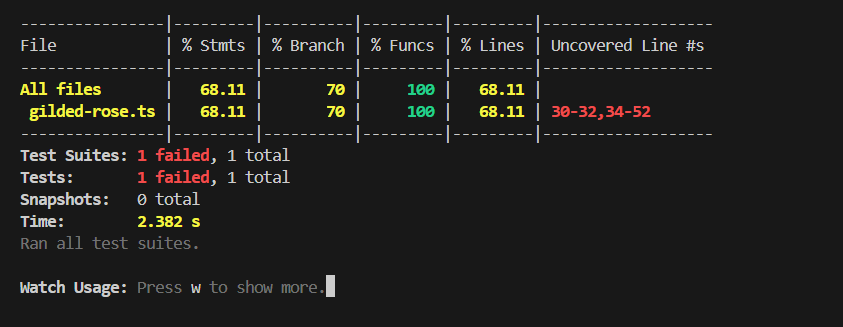
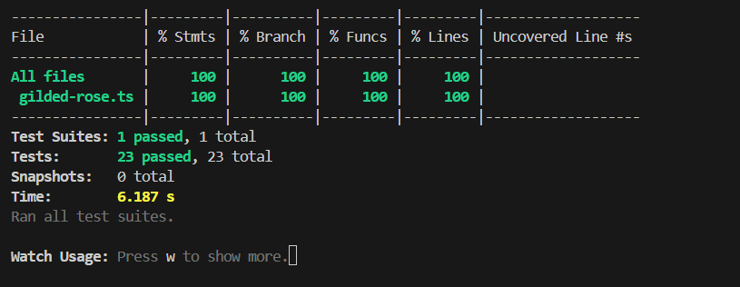

# Gilded Rose Refactoring Kata (TypeScript)

**Language used: TypeScript** (inside the `TypeScript/` folder, tested with Jest). The other language folders are from the original template and I haven't touched them.

## What this is

This is my solution to the Gilded Rose kata. The starting point was a long, nested `if/else` version of `updateQuality()`, and the job was to add tests, clean the code up, fix the bugs, and add support for "Conjured" items.

## How to run it

```bash
cd TypeScript
npm install
npm test
```

To see the coverage report:

```bash
npm test -- --coverage
```

## What I did

I worked in this order, and the git history follows it:

<<<<<<< HEAD
1. **Wrote tests first** for the existing behaviour and for the Conjured requirement. The Conjured tests failed on the old code, which confirmed the bug.
2. **Refactored `updateQuality()`** so each item type has its own small method instead of one giant block of nested ifs.
3. **Fixed Conjured items** so they degrade twice as fast as normal ones.
4. **Removed the Mocha tests** so there is only one test runner (Jest) and `npm test` runs it directly.
=======
1. **Wrote tests first** for the existing behaviour and for the Conjured requirement. The Conjured tests failed on the old code, which confirmed the bug. Upon checking, I realized that the old test code was made to failed so I wrote 23 new test cases which will check all the rules of the items.
2. **Refactored `updateQuality()`** so each item type has its own small method instead of one giant block of nested ifs which makes the code messy making it difficult to understand for developers.
3. **Fixed Conjured items** so they degrade twice as fast as normal ones.
4. **Removed the Mocha tests** so there is only one test runner (Jest) and that can be tested by running `npm run test:jest:watch`.
>>>>>>> d3b10e0 (Updated the Readme.md file for better explanation)

## How the code is structured

All the code is in `TypeScript/app/gilded-rose.ts`.

<<<<<<< HEAD
- `updateQuality()` loops over the items, skips Sulfuras, works out the new quality, clamps it, and reduces `sellIn` by one.
- `getNewQuality()` picks the right rule based on the item name.
- One small method per item type: `updateNormalItem`, `updateAgedBrie`, `updateBackstagePass`, `updateConjuredItem`.
- `clampQuality()` keeps quality between 0 and 50. It's in one place, so the rule isn't repeated in every method.
- `isExpired()` is the one place that decides if the sell-by date has passed.
- Item names and the min/max quality are constants, so there are no magic strings or numbers.

I did **not** change the `Item` class, since the instructions say it belongs to the goblin.
=======
- `updateQuality()` loops over the items, skips Sulfuras, works out the new quality, and reduces `sellIn` by one.
- `getNewQuality()` picks the right rule based on the item name.
- One small method per item type: `updateNormalItem`, `updateAgedBrie`, `updateBackstagePass`, `updateConjuredItem`.
- `QualityChecker()` keeps quality between 0 and 50. It's in one place, so the rule isn't repeated in every method.
- `ExpiredItem()` is the one place that decides if the sell-by date has passed.
- Item names and the min/max quality are constants, so there are no magic strings or numbers.

I did **not** change the `Item` class, since the instructions say it belongs to the goblin which will one-shot me.
>>>>>>> d3b10e0 (Updated the Readme.md file for better explanation)

## Assumptions

The requirements left a few things open, so I made these calls (they are also written as comments in the code):

<<<<<<< HEAD
=======
- Any item if gots the quality in negative or exceeds 50(excepts Sulfuras), to prevent it, created a `QualityChecker()`.
>>>>>>> d3b10e0 (Updated the Readme.md file for better explanation)
- An item counts as **expired when `sellIn <= 0`** at the time of the update.
- **Any item whose name starts with "Conjured"** is treated as a conjured item.
- Conjured items lose **2 quality per day**, and **4 per day** after the sell-by date (twice the normal rate).
- **Aged Brie** gains +2 after the sell-by date (+1 before it).
- **Backstage passes** gain +1 when there are more than 10 days left, +2 at 10 days or less, +3 at 5 days or less, and drop to 0 after the concert.
- **Sulfuras** is never changed: its quality and `sellIn` stay exactly as they are.

## Tests

The tests are in `TypeScript/test/jest/gilded-rose.spec.ts` and are grouped by item type: normal items, Aged Brie, Sulfuras, Backstage passes and Conjured items.

I focused on boundary values because that's where off-by-one bugs usually hide: quality at 0 and 50, and backstage pass `sellIn` at 11, 10, 6, 5, 1 and 0. There's also one multi-day test that runs a backstage pass through its whole life.

The `golden-master-text-test.ts` file from the template is untouched. I used it to compare the output before and after the refactor.

## Test results and coverage

I ran `npm test -- --coverage` before and after my changes.

| | Before | After |
|---|---|---|
| Test suites | 1 failed, 1 total | 1 passed, 1 total |
| Tests | 1 failed, 1 total | 23 passed, 23 total |
| Statements | 68.11% | 100% |
| Branches | 70% | 100% |
| Functions | 100% | 100% |
| Lines | 68.11% | 100% |

**Before:** the only test was the placeholder from the template (it expects the item name to be `fixme`), so it failed. It also ran just one item through the old code, which is why coverage was only around 68%. Lines 30-52 of the original `updateQuality()` were never executed.

<<<<<<< HEAD
**After:** 23 tests cover every item type and every boundary, and every statement, branch, function and line is covered.



=======


**After:** 23 tests cover every item type and every boundary, and every statement, branch, function and line is covered.


>>>>>>> d3b10e0 (Updated the Readme.md file for better explanation)

## Things I would do with more time

- Move each item type into its own strategy class, so adding a new type doesn't mean editing existing code.
<<<<<<< HEAD
- Add property-based tests to check that quality always stays between 0 and 50.
=======
>>>>>>> d3b10e0 (Updated the Readme.md file for better explanation)
